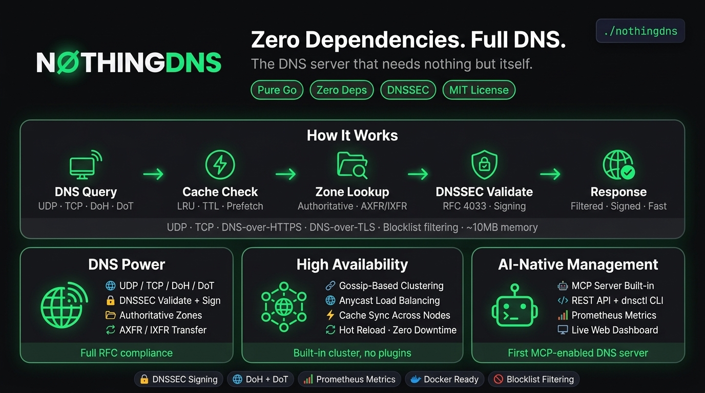

# NothingDNS

<p align="center">
  
</p>

[](https://golang.org)
[](LICENSE)
[](https://goreportcard.com/report/github.com/nothingdns/nothingdns)

A zero-dependency DNS server written in pure Go. NothingDNS is designed to be lightweight, fast, and self-contained with no external dependencies.

## Features

### Core DNS
- **Zero Dependencies** - Pure Go implementation, no external libraries
- **DNS Protocol Support** - Full RFC 1035 compliant DNS message handling
- **UDP & TCP** - Support for both UDP and TCP DNS queries with SO_REUSEPORT
- **Caching** - Thread-safe LRU cache with TTL support, prefetching, and negative caching (RFC 2308)
- **Upstream Forwarding** - Multiple upstream servers with health checking, failover, and TCP connection pooling
- **Dynamic Upstreams** - Add/remove upstream servers at runtime via API
- **Iterative Resolver** - Full recursive resolution with CNAME chasing and delegation following
- **QNAME Minimization** - RFC 7816 privacy protection during iterative resolution
- **DNS64/NAT64** - IPv6 transition mechanism synthesizing AAAA from A records (RFC 6147)
- **SVCB/HTTPS Records** - Service Binding and HTTPS record types (RFC 9460)
- **IDNA** - Internationalized Domain Names validation (RFC 5891)

### Security
- **DNSSEC** - DNS Security Extensions validation and zone signing (RFC 4033/4034/4035)
- **DNSSEC Algorithms** - RSA/SHA-256, RSA/SHA-512, ECDSA P-256/P-384, Ed25519
- **DNSSEC Key Rollover** - Automatic key lifecycle management (RFC 7583)
- **DNS over HTTPS (DoH)** - RFC 8484 compliant DoH support
- **DNS over TLS (DoT)** - RFC 7858 compliant DoT support
- **DNS Cookies** - RFC 7873 anti-spoofing with HMAC-SHA256 client/server cookies
- **DNS over QUIC (DoQ)** - QUIC-based encrypted DNS transport
- **Oblivious DNS over HTTPS (ODoH)** - RFC 9230 privacy-preserving DNS proxy
- **Blocklist Support** - Block domains using hosts file format or URL-based lists
- **Response Policy Zones (RPZ)** - Policy-based DNS filtering with NXDOMAIN, NODATA, redirect, and DROP actions
- **Response Rate Limiting (RRL)** - Per-client token bucket rate limiting
- **ACL** - Access control lists for client filtering
- **Gossip Encryption** - AES-256-GCM encryption for inter-node communication

### Authoritative
- **Authoritative Zones** - Zone file support for hosting your own DNS records
- **Authoritative-Only Mode** - Return NXDOMAIN for non-zone queries instead of forwarding
- **Slave Zones** - AXFR/IXFR zone transfer from master servers
- **Zone Transfer** - AXFR support for serving zones to secondary servers
- **$GENERATE Directive** - BIND-compatible record generation for bulk entries
- **Split-Horizon DNS** - View-based zone selection by client IP for internal/external resolution
- **GeoIP DNS** - Geographic DNS responses using MaxMind MMDB databases

### High Availability
- **Clustering** - Gossip-based cluster membership with cache synchronization
- **Anycast/Load Balancing** - Geographic load balancing with health checks
- **Hot Reload** - SIGHUP for configuration reload without downtime
- **Memory Monitoring** - Runtime memory tracking with OOM protection and automatic cache eviction

### Storage & Persistence
- **KV Store** - Built-in key-value store with ACID transactions
- **WAL** - Write-ahead logging for crash recovery
- **TLV Serialization** - Efficient binary serialization

### Management & Observability
- **Web Dashboard** - React 19 SPA with real-time WebSocket query streaming
- **Web Zone Manager** - Browser-based CRUD for zones and DNS records
- **HTTP API** - RESTful API with OpenAPI 3.0 specification and Swagger UI
- **MCP Server** - Model Context Protocol for AI assistant integration
- **Prometheus Metrics** - Export metrics for monitoring
- **Audit Logging** - Structured query audit trail with client IP, latency, and cache status
- **Management CLI** - `dnsctl` tool for zone and server management

## Installation

### Quick Install

```bash
# Linux/macOS
curl -fsSL https://raw.githubusercontent.com/NothingDNS/NothingDNS/main/install.sh | bash

# Windows (PowerShell as Admin)
irm https://raw.githubusercontent.com/NothingDNS/NothingDNS/main/install.ps1 | iex
```

### Manual Download

Download binaries from the [latest release](https://github.com/NothingDNS/NothingDNS/releases/latest):

| Platform | Binary |
|----------|--------|
| Linux amd64 | `nothingdns-linux-amd64` |
| Linux arm64 | `nothingdns-linux-arm64` |
| macOS amd64 | `nothingdns-darwin-amd64` |
| macOS arm64 | `nothingdns-darwin-arm64` |
| Windows | `nothingdns-windows-amd64.exe` |

### Build from Source

```bash
# Build the server
go build -o nothingdns ./cmd/nothingdns

# Build the CLI tool
go build -o dnsctl ./cmd/dnsctl
```

### Run

```bash
# Start with default configuration
./nothingdns

# Start with custom config
./nothingdns --config /path/to/config.yaml
```

### Test

```bash
# All tests (38 packages)
go test ./... -count=1

# Short mode (skip slow tests)
go test ./... -count=1 -short

# E2E tests only
go test ./internal/e2e/... -v

# With coverage
go test ./... -cover
```

## Management

### Service Control (systemd)

```bash
# Start/Stop/Restart
sudo systemctl start nothingdns
sudo systemctl stop nothingdns
sudo systemctl restart nothingdns

# Check status
sudo systemctl status nothingdns

# View logs
sudo journalctl -u nothingdns -f
sudo journalctl -u nothingdns --since '1 hour ago'

# Reload config (hot reload)
sudo systemctl reload nothingdns
# Or send SIGHUP
sudo killall -HUP nothingdns
```

### Update

```bash
# Update to latest version (auto-restarts)
curl -fsSL https://raw.githubusercontent.com/NothingDNS/NothingDNS/main/update.sh | bash
```

### Uninstall

```bash
# Remove NothingDNS
curl -fsSL https://raw.githubusercontent.com/NothingDNS/NothingDNS/main/uninstall.sh | bash
```

### Dashboard

After installation, access the dashboard at `http://localhost:8080`

Use the credentials shown at the end of installation:
- Username: `admin`
- Password: (generated password)

## Configuration

Create a `nothingdns.yaml` file:

```yaml
server:
  port: 5353
  bind:
    - 0.0.0.0
  tls:
    enabled: false

resolution:
  timeout: "5s"

upstream:
  strategy: round_robin
  servers:
    - 1.1.1.1:53
    - 8.8.8.8:53

cache:
  size: 10000
  min_ttl: 300
  max_ttl: 86400
  default_ttl: 3600
  negative_ttl: 60
  prefetch: true
  prefetch_threshold: 28800

logging:
  level: info
  format: text
  output: stdout

zones:
  - /etc/nothingdns/zones/example.com.zone

acl:
  - action: allow
    networks:
      - 127.0.0.1/32
  - action: allow
    networks:
      - 10.0.0.0/8
  - action: deny
    networks:
      - 0.0.0.0/0
```

## Zone File Format

NothingDNS uses a simple zone file format:

```
$ORIGIN example.com.
$TTL 3600

@   IN  SOA ns1.example.com. admin.example.com. (
            2024010101  ; Serial
            3600        ; Refresh
            1800        ; Retry
            604800      ; Expire
            86400 )     ; Minimum TTL

@       IN  A       192.0.2.1
www     IN  A       192.0.2.2
mail    IN  A       192.0.2.3
@       IN  MX  10  mail.example.com.
@       IN  NS      ns1.example.com.
@       IN  TXT     "v=spf1 include:_spf.example.com ~all"
```

## CLI Usage

The `dnsctl` tool provides management capabilities:

```bash
# Check server status
dnsctl server status

# List zones
dnsctl zone list

# Reload zones
dnsctl zone reload example.com

# Cache operations
dnsctl cache stats
dnsctl cache flush

# DNSSEC operations
dnsctl dnssec generate-key --algorithm 13 --type KSK --zone example.com
dnsctl dnssec ds-from-dnskey --zone example.com --key-file Kexample.com.+013+12345.key

# Configuration reload
dnsctl config reload
```

## HTTP API

NothingDNS provides a RESTful HTTP API for management and monitoring:

```yaml
server:
  http:
    enabled: true
    bind: "127.0.0.1:8080"
    auth_token: "your-secret-token"  # Optional
```

### Endpoints

| Endpoint | Method | Description |
|----------|--------|-------------|
| `/health` | GET | Health check |
| `/api/v1/status` | GET | Server status and cache stats |
| `/api/v1/zones` | GET | List loaded zones |
| `/api/v1/zones/reload?zone=<name>` | POST | Reload a zone |
| `/api/v1/cache/stats` | GET | Cache statistics |
| `/api/v1/cache/flush` | POST | Flush the cache |
| `/api/v1/config/reload` | POST | Reload configuration |
| `/api/v1/cluster/status` | GET | Cluster health and statistics |
| `/api/v1/cluster/nodes` | GET | List all cluster nodes |
| `/api/dashboard/stats` | GET | Dashboard statistics |
| `/api/dashboard/queries` | GET | Recent queries |
| `/api/dashboard/zones` | GET | Zone list for dashboard |
| `/ws` | WS | WebSocket for live query stream |
| `/` | GET | Web dashboard UI |

### Authentication

When `auth_token` is configured, include it via header or query parameter:

```bash
# Via header
curl -H "Authorization: Bearer your-secret-token" http://localhost:8080/api/v1/status

# Via query parameter
curl http://localhost:8080/api/v1/status?token=your-secret-token
```

## DNS over HTTPS (DoH)

NothingDNS supports RFC 8484 compliant DNS over HTTPS (DoH). DoH provides encrypted DNS resolution over HTTPS, preventing eavesdropping and tampering.

### Configuration

```yaml
server:
  http:
    enabled: true
    bind: "0.0.0.0:8080"
    auth_token: "your-secret-token"  # Optional - not required for DoH
    doh_enabled: true                # Enable DoH endpoint
    doh_path: "/dns-query"           # DoH endpoint path (default: /dns-query)
```

### Usage

DoH supports both GET and POST methods as per RFC 8484:

**GET Request:**
```bash
# Encode DNS query in base64url
dns_query=$(echo -n 'AAABAAABAAAAAAAAA3d3dwdleGFtcGxlA2NvbQAAAQAB' | base64 -d | base64 -w0 | tr '+/' '-_' | tr -d '=')
curl "http://localhost:8080/dns-query?dns=${dns_query}"
```

**POST Request:**
```bash
curl -X POST http://localhost:8080/dns-query \
  -H "Content-Type: application/dns-message" \
  --data-binary @dns-query.bin
```

**Using dig:**
```bash
dig @localhost -p 8080 +https www.example.com
```

### Security Notes

- The DoH endpoint does not require authentication (following RFC 8484)
- Management API endpoints still require auth_token when configured
- DoH responses include `X-Content-Type-Options: nosniff` header

## DNS over TLS (DoT)

NothingDNS supports RFC 7858 compliant DNS over TLS (DoT). DoT provides encrypted DNS resolution using TLS on port 853, preventing eavesdropping and tampering.

### Configuration

```yaml
server:
  port: 5353
  bind:
    - 0.0.0.0
  tls:
    enabled: true
    bind: "0.0.0.0:853"
    cert_file: "/etc/nothingdns/certs/server.crt"
    key_file: "/etc/nothingdns/certs/server.key"
```

### Usage

DoT uses standard DNS message format over a TLS connection on port 853:

**Using kdig:**
```bash
kdig @localhost +tls-ca +tls-host=localhost www.example.com
```

**Using systemd-resolved:**
```bash
# Add to /etc/systemd/resolved.conf.d/dot.conf
[Resolve]
DNS=localhost:853
DNSOverTLS=yes
```

**Using Android/iOS:**
Configure private DNS with hostname pointing to your DoT server.

### Security Notes

- TLS certificate must be valid and trusted by clients
- Default port is 853 (can be customized via bind address)
- Certificate should include the hostname clients use to connect
- Self-signed certificates work for testing but require client configuration

## DNSSEC

NothingDNS supports DNSSEC (DNS Security Extensions) for both validation and zone signing. DNSSEC provides authentication and integrity protection for DNS data through digital signatures.

### DNSSEC Validation

When enabled, NothingDNS validates DNSSEC signatures from upstream servers:

```yaml
dnssec:
  enabled: true
  require_dnssec: false    # Fail queries if DNSSEC validation fails
  ignore_time: false       # Ignore signature timestamps (for testing)
  trust_anchor: ""         # Path to RFC 7958 trust anchor file (optional)
```

### Zone Signing

NothingDNS can sign authoritative zones with DNSSEC:

```yaml
dnssec:
  enabled: true
  signing:
    enabled: true
    signature_validity: "720h"    # 30 days
    keys:
      - private_key: /etc/nothingdns/keys/ksk.pem
        type: ksk
        algorithm: 13               # ECDSAP256SHA256
      - private_key: /etc/nothingdns/keys/zsk.pem
        type: zsk
        algorithm: 13
    nsec3:
      iterations: 10
      salt: "aabbccdd"
      opt_out: false
```

### Supported Algorithms

| Algorithm | Number | Status |
|-----------|--------|--------|
| RSA/SHA-256 | 8 | Supported |
| RSA/SHA-512 | 10 | Supported |
| ECDSA P-256/SHA-256 | 13 | Supported |
| ECDSA P-384/SHA-384 | 14 | Supported |
| Ed25519 | 15 | Recommended |

### DNSSEC CLI Commands

The `dnsctl` tool provides DNSSEC management:

```bash
# Generate a KSK (Key Signing Key)
dnsctl dnssec generate-key \
  --algorithm 13 \
  --type KSK \
  --zone example.com \
  --output /etc/nothingdns/keys/

# Generate a ZSK (Zone Signing Key)
dnsctl dnssec generate-key \
  --algorithm 13 \
  --type ZSK \
  --zone example.com \
  --output /etc/nothingdns/keys/

# Create DS record from DNSKEY
dnsctl dnssec ds-from-dnskey \
  --zone example.com \
  --key-file Kexample.com.+013+12345.key

# Sign a zone file
dnsctl dnssec sign-zone \
  --input example.com.zone \
  --output example.com.signed

# Verify trust anchor file
dnsctl dnssec verify-anchor root-anchors.xml
```

### DNSSEC Testing

Test DNSSEC validation using `dig`:

```bash
# Query with DNSSEC (requests RRSIG records)
dig @localhost +dnssec www.isc.org

# Check AD (Authenticated Data) bit
dig @localhost +dnssec +adflag www.isc.org | grep "flags:"

# Trace DNSSEC validation
dig @localhost +dnssec +trace www.isc.org
```

## Response Policy Zones (RPZ)

RPZ allows policy-based DNS filtering using standard zone file format. Trigger types include QNAME, client IP (CIDR), response IP, NSDNAME, and NSIP.

### Configuration

```yaml
rpz:
  enabled: true
  files:
    - /etc/nothingdns/rpz/malware.rpz
  zones:
    - name: "block-malware"
      file: /etc/nothingdns/rpz/malware.rpz
      priority: 10
```

### Supported Actions

| Action | Description |
|--------|-------------|
| NXDOMAIN | Return NXDOMAIN (domain does not exist) |
| NODATA | Return empty response (no records) |
| CNAME | Redirect to another domain |
| IP Override | Return a specific IP address |
| DROP | Silently drop the query |
| PASSTHROUGH | Allow the query (whitelist) |
| TCP-ONLY | Force client to retry over TCP |

## GeoIP DNS

Serve different DNS responses based on the geographic location of the client using MaxMind MMDB databases.

### Configuration

```yaml
geodns:
  enabled: true
  mmdb_file: /etc/nothingdns/GeoLite2-Country.mmdb
  rules:
    - domain: "cdn.example.com"
      type: A
      default: "203.0.113.1"
      records:
        US: "198.51.100.1"
        DE: "198.51.100.2"
        JP: "198.51.100.3"
```

Clients from the US will resolve `cdn.example.com` to `198.51.100.1`, clients from Germany to `198.51.100.2`, and so on. Unmatched countries fall back to the `default` address.

## Split-Horizon DNS (Views)

Serve different zone data to different clients based on their source IP. Useful for returning internal IPs to office networks and public IPs to external clients.

### Configuration

```yaml
views:
  - name: internal
    match_clients:
      - "10.0.0.0/8"
      - "192.168.0.0/16"
    zone_files:
      - /etc/nothingdns/zones/internal/example.com.zone

  - name: external
    match_clients:
      - "any"
    zone_files:
      - /etc/nothingdns/zones/external/example.com.zone
```

Views are evaluated in order; the first matching view wins. Use `"any"` as a catch-all for the default view.

## Response Rate Limiting (RRL)

Protect against DNS amplification attacks with per-client token bucket rate limiting.

### Configuration

```yaml
rrl:
  enabled: true
  rate: 5       # Tokens per second per client
  burst: 20     # Maximum burst size
```

## Clustering

NothingDNS supports clustering for high availability and cache synchronization across multiple nodes. The clustering implementation uses a gossip-based membership protocol (SWIM-like) with UDP-based communication.

### Features

- **Automatic Node Discovery** - Nodes automatically join and discover other cluster members
- **Failure Detection** - Automatic detection of failed nodes with suspect/dead states
- **Cache Synchronization** - Cross-node cache invalidation broadcasts
- **Quorum-based Health** - Cluster health based on majority of alive nodes
- **Region/Zone Support** - Organize nodes by region and zone for topology awareness
- **AES-256-GCM Encryption** - Encrypted gossip communication between nodes
- **Prometheus Metrics** - Export cluster metrics (node count, health, gossip stats)

### Configuration

```yaml
cluster:
  enabled: true
  node_id: ""              # Auto-generated if empty
  bind_addr: ""            # Auto-detect if empty
  gossip_port: 7946        # UDP port for gossip protocol
  region: "us-east"
  zone: "us-east-1a"
  weight: 100              # Load balancing weight
  seed_nodes:              # Initial nodes to join
    - "10.0.1.10:7946"
    - "10.0.1.11:7946"
  cache_sync: true         # Enable cache invalidation sync
```

### How It Works

1. **Node Join**: When a node starts, it joins the cluster by connecting to seed nodes
2. **Gossip Protocol**: Nodes periodically exchange membership information via UDP
3. **Failure Detection**: Uses indirect pings and suspect state before marking nodes dead
4. **Cache Sync**: Cache invalidations are broadcast to all nodes when entries are deleted
5. **Health Check**: Cluster is healthy when majority of nodes (quorum) are alive

### API Endpoints

| Endpoint | Method | Description |
|----------|--------|-------------|
| `/api/v1/cluster/status` | GET | Cluster health and statistics |
| `/api/v1/cluster/nodes` | GET | List all cluster nodes |

### Prometheus Metrics

Cluster metrics are automatically exported:

```
nothingdns_cluster_nodes_total 3
nothingdns_cluster_nodes_alive 3
nothingdns_cluster_healthy 1
nothingdns_cluster_gossip_messages_sent_total 1234
nothingdns_cluster_gossip_messages_received_total 1230
```

### Running a Cluster

**Node 1:**
```bash
# config-node1.yaml
cluster:
  enabled: true
  node_id: "node-1"
  bind_addr: "10.0.1.10"
  gossip_port: 7946
  region: "us-east"
  cache_sync: true

./nothingdns -config config-node1.yaml
```

**Node 2:**
```bash
# config-node2.yaml
cluster:
  enabled: true
  node_id: "node-2"
  bind_addr: "10.0.1.11"
  gossip_port: 7946
  region: "us-east"
  seed_nodes:
    - "10.0.1.10:7946"
  cache_sync: true

./nothingdns -config config-node2.yaml
```

**Node 3:**
```bash
# config-node3.yaml
cluster:
  enabled: true
  node_id: "node-3"
  bind_addr: "10.0.1.12"
  gossip_port: 7946
  region: "us-east"
  seed_nodes:
    - "10.0.1.10:7946"
  cache_sync: true

./nothingdns -config config-node3.yaml
```

## Architecture

```
┌─────────────────────────────────────────────────────────────────────────┐
│                           NothingDNS                                     │
├─────────────────────────────────────────────────────────────────────────┤
│  UDP Server  │  TCP Server  │  DoH Server  │  DoT Server  │  Dashboard  │
├──────────────────────────────────────────────────────────────────────────┤
│                          Request Handler                                  │
│  ┌─────────┐  ┌─────────────┐  ┌─────────────┐  ┌────────────────────┐  │
│  │  Cache  │→ │ Auth Zones  │→ │  Upstream   │→ │ DNSSEC Validator   │  │
│  │ (LRU)   │  │ + Transfer  │  │ + Anycast   │  │                    │  │
│  └────↑────┘  └─────────────┘  └─────────────┘  └────────────────────┘  │
│       │                       ┌───────────────────────────────────────┐  │
│       │                       │         Storage Layer                 │  │
│       └───────────────────────│  KV Store │ WAL │ TLV Serialization  │  │
│                               └───────────────────────────────────────┘  │
│       │         ┌──────────────────────────────┐                        │
│       └────────→│      Cluster Manager         │                        │
│                 │   (Gossip / Cache Sync)      │                        │
│                 └──────────────────────────────┘                        │
├─────────────────────────────────────────────────────────────────────────┤
│                    API Layer (HTTP + MCP)                                │
├─────────────────────────────────────────────────────────────────────────┤
│                    Config Parser (YAML) + Hot Reload                     │
└─────────────────────────────────────────────────────────────────────────┘
```

## Project Structure

```
.
├── cmd/
│   ├── nothingdns/     # Main DNS server binary
│   └── dnsctl/         # CLI management tool
├── internal/
│   ├── api/            # HTTP API with OpenAPI 3.0 / Swagger
│   │   └── mcp/        # MCP server for AI integration
│   ├── audit/          # Structured query audit logging
│   ├── auth/           # Authentication middleware
│   ├── blocklist/      # Domain blocklist engine
│   ├── cache/          # LRU cache with TTL and negative caching
│   ├── catalog/        # Zone catalog for managing zone metadata
│   ├── cluster/        # Gossip-based clustering with AES-256-GCM
│   ├── config/         # Custom YAML configuration parser
│   ├── dashboard/      # Embedded React 19 SPA (served from internal/dashboard/static/)
│   ├── dns64/          # DNS64/NAT64 synthesis (RFC 6147)
│   ├── dnscookie/      # DNS Cookies (RFC 7873)
│   ├── dnssec/         # DNSSEC validation, signing, key rollover
│   ├── doh/            # DNS over HTTPS (RFC 8484)
│   ├── e2e/            # End-to-end tests
│   ├── filter/         # Split-horizon views, rate limiting, ACL
│   ├── geodns/         # GeoIP DNS with MMDB support
│   ├── idna/           # Internationalized domain name validation
│   ├── load/           # Load balancing and anycast
│   ├── memory/         # Runtime memory monitoring and OOM protection
│   ├── metrics/        # Prometheus metrics export
│   ├── odoh/           # Oblivious DNS over HTTPS (RFC 9230)
│   ├── otel/           # OpenTelemetry tracing
│   ├── protocol/       # DNS wire protocol parser (RFC 1035)
│   ├── quic/           # DNS over QUIC transport
│   ├── resolver/       # Iterative recursive resolver with CNAME chasing
│   ├── rpz/            # Response Policy Zones for DNS filtering
│   ├── server/         # UDP/TCP/TLS transport handlers
│   ├── storage/        # KV store with WAL and TLV serialization
│   ├── transfer/       # AXFR/IXFR zone transfers
│   ├── upstream/       # Upstream forwarding with health checks and load balancing
│   ├── websocket/      # WebSocket server for live query streaming
│   └── zone/           # BIND format zone file parser with $GENERATE support
├── docs/               # Additional documentation
├── Dockerfile
├── docker-compose.yml
└── go.mod
```

## Supported Record Types

- A (IPv4 address)
- AAAA (IPv6 address)
- CNAME (Canonical name)
- MX (Mail exchange)
- NS (Name server)
- TXT (Text record)
- SOA (Start of authority)
- PTR (Pointer)
- SRV (Service locator)
- DS (Delegation Signer)
- DNSKEY (DNS Public Key)
- RRSIG (Resource Record Signature)
- NSEC/NSEC3 (Authenticated Denial of Existence)

## Upstream Strategies

- **round_robin** - Rotate through upstream servers
- **random** - Random selection
- **fastest** - Use the fastest responding server

## Docker

### Quick Start with Docker (GHCR)

```bash
# Pull from GitHub Container Registry
docker pull ghcr.io/nothingdns/nothingdns:latest

# Run with default configuration
docker run -d \
  -p 53:53/udp \
  -p 53:53 \
  -p 8080:8080 \
  ghcr.io/nothingdns/nothingdns:latest

# Run with custom configuration
docker run -d \
  -p 53:53/udp \
  -p 53:53 \
  -p 8080:8080 \
  -v /etc/nothingdns:/etc/nothingdns \
  ghcr.io/nothingdns/nothingdns:latest --config /etc/nothingdns/config.yaml
```

### Build Locally

```bash
# Build the image
docker build -t nothingdns:latest .

# Run with local build
docker run -d -p 53:53/udp -p 53:53 -p 8080:8080 nothingdns:latest
```

### Docker Compose Cluster

```yaml
# docker-compose.yml
services:
  nothingdns-1:
    image: ghcr.io/nothingdns/nothingdns:latest
    hostname: nothingdns-1
    ports:
      - "53:53/udp"
      - "53:53"
      - "8080:8080"
    volumes:
      - ./config-node1.yaml:/etc/nothingdns/config.yaml
      - ./zones:/etc/nothingdns/zones
    networks:
      - dns-net

  nothingdns-2:
    image: nothingdns:latest
    hostname: nothingdns-2
    ports:
      - "5354:53/udp"
      - "5354:53"
      - "8081:8080"
    volumes:
      - ./config-node2.yaml:/etc/nothingdns/config.yaml
      - ./zones:/etc/nothingdns/zones
    networks:
      - dns-net

  nothingdns-3:
    image: nothingdns:latest
    hostname: nothingdns-3
    ports:
      - "5355:53/udp"
      - "5355:53"
      - "8082:8080"
    volumes:
      - ./config-node3.yaml:/etc/nothingdns/config.yaml
      - ./zones:/etc/nothingdns/zones
    networks:
      - dns-net

networks:
  dns-net:
    driver: bridge
```

## Web Dashboard

NothingDNS includes a built-in web dashboard for real-time monitoring:

```yaml
server:
  http:
    enabled: true
    bind: "0.0.0.0:8080"
```

Access the dashboard at `http://localhost:8080/`

### Dashboard Features

- Real-time query stream via WebSocket
- Statistics cards (queries, cache hit rate, blocked, zones)
- Live query visualization with status badges
- Auto-reconnecting WebSocket connection

## MCP Server (AI Integration)

NothingDNS provides a Model Context Protocol (MCP) server for AI assistant integration:

```yaml
server:
  http:
    enabled: true
    bind: "0.0.0.0:8080"
```

### Available MCP Tools

| Tool | Description |
|------|-------------|
| `dns_query` | Query DNS records for a domain |
| `zone_list` | List all configured zones |
| `zone_get` | Get details of a specific zone |
| `zone_create` | Create a new zone |
| `zone_delete` | Delete a zone |
| `record_add` | Add a DNS record to a zone |
| `record_delete` | Delete a DNS record |
| `record_list` | List records in a zone |
| `cache_stats` | Get cache statistics |
| `cache_flush` | Flush the DNS cache |
| `blocklist_check` | Check if a domain is blocked |
| `server_stats` | Get server statistics |

## Storage & Persistence

NothingDNS includes a built-in key-value store with WAL support.

### Features

- ACID transactions with atomic writes
- Write-ahead logging (WAL) for crash recovery
- TLV binary serialization for efficiency
- Cursor-based iteration
- Bucket-based organization

## Hot Reload

Send `SIGHUP` to reload configuration without downtime:

```bash
# Reload configuration
kill -HUP $(pidof nothingdns)

# Or via CLI
dnsctl config reload
```

### Reloadable Components

- Zone files
- Blocklist files
- ACL rules
- Rate limits
- TLS certificates
- Log level

## Comparison

| Feature | NothingDNS | CoreDNS | PowerDNS | Unbound |
|---------|------------|---------|----------|---------|
| Zero Dependencies | ✅ | ❌ | ❌ | ❌ |
| Pure Go | ✅ | ✅ | ❌ | ❌ |
| DNSSEC Validation | ✅ | ✅ | ✅ | ✅ |
| DNSSEC Signing | ✅ | ❌ | ✅ | ❌ |
| Ed25519 DNSSEC | ✅ | ✅ | ✅ | ✅ |
| DoH Support | ✅ | ✅ | ✅ | ✅ |
| DoT Support | ✅ | ✅ | ✅ | ✅ |
| DoQ Support | ✅ | ❌ | ❌ | ❌ |
| RPZ | ✅ | ✅ | ✅ | ✅ |
| GeoIP DNS | ✅ | ✅ | ✅ | ❌ |
| Split-Horizon | ✅ | ✅ | ✅ | ❌ |
| Web Dashboard | ✅ | ❌ | ✅ | ❌ |
| MCP/AI Integration | ✅ | ❌ | ❌ | ❌ |
| Built-in Clustering | ✅ | ✅ | ✅ | ❌ |
| Zone Transfer (AXFR) | ✅ | ✅ | ✅ | ❌ |
| Anycast LB | ✅ | ❌ | ❌ | ❌ |
| Hot Reload | ✅ | ✅ | ✅ | ✅ |
| Memory Footprint | ~10MB | ~30MB | ~50MB | ~20MB |

## Systemd Service

Create `/etc/systemd/system/nothingdns.service`:

```ini
[Unit]
Description=NothingDNS Server
After=network.target
Wants=network-online.target

[Service]
Type=simple
User=nobody
Group=nogroup
ExecStart=/usr/local/bin/nothingdns -config /etc/nothingdns/config.yaml
ExecReload=/bin/kill -HUP $MAINPID
Restart=on-failure
RestartSec=5
LimitNOFILE=65535
CapabilityBoundingSet=CAP_NET_BIND_SERVICE
AmbientCapabilities=CAP_NET_BIND_SERVICE
NoNewPrivileges=true

[Install]
WantedBy=multi-user.target
```

```bash
# Enable and start
systemctl enable nothingdns
systemctl start nothingdns

# Reload configuration
systemctl reload nothingdns
```

## License

MIT License - See LICENSE file for details

## Contributing

Contributions are welcome! Please ensure:

1. All tests pass (`go test ./...`)
2. Code follows Go conventions (`go fmt`, `go vet`)
3. New features include tests

## Roadmap

- [x] DNSSEC validation and signing
- [x] Ed25519 DNSSEC signing (Algorithm 15)
- [x] Automatic DNSSEC key rollover (RFC 7583)
- [x] HTTP API for management
- [x] OpenAPI 3.0 specification with Swagger UI
- [x] Clustering support with AES-256-GCM encryption
- [x] Blocklist support (hosts file format)
- [x] Response Policy Zones (RPZ)
- [x] Response Rate Limiting (RRL)
- [x] Metrics export (Prometheus)
- [x] DoH (DNS over HTTPS) support
- [x] DoT (DNS over TLS) support
- [x] DNS over QUIC (DoQ) transport
- [x] Web dashboard (React 19 SPA)
- [x] Web GUI for zone management
- [x] MCP server for AI integration
- [x] Storage & persistence (KV store + WAL)
- [x] Anycast/Load balancing
- [x] Slave zone support (AXFR/IXFR)
- [x] Configuration hot reload
- [x] GeoIP-based DNS responses (MMDB)
- [x] Split-horizon DNS views
- [x] Iterative recursive resolver
- [x] Runtime memory monitoring and OOM protection
- [x] Audit logging
- [x] Production-ready code quality (see [docs/PRODUCTION_READINESS.md](docs/PRODUCTION_READINESS.md))
- [x] DNS64/NAT64 support (RFC 6147)
- [x] SVCB/HTTPS record types (RFC 9460)
- [x] DNS Cookies anti-spoofing (RFC 7873)
- [x] QNAME Minimization privacy (RFC 7816)
# test
